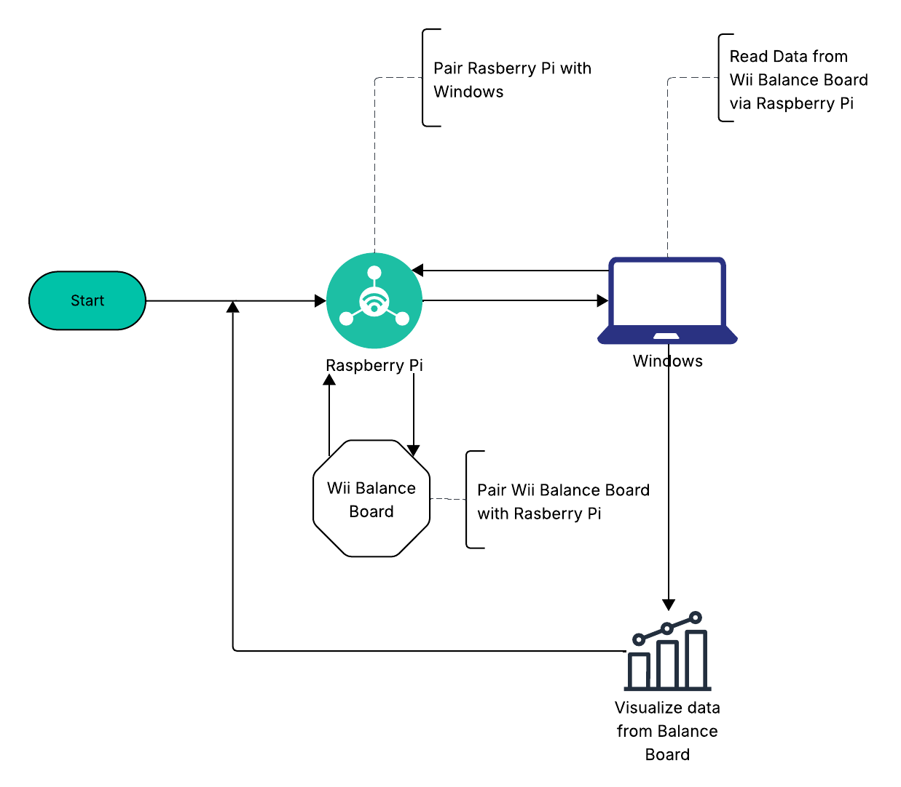

# BalanceBridge: Wii Balance Board Controller for Windows & Unity
_Modernizing the Wii Balance Board for Windows 11, Unity, and Steam._

This project makes the Wii Balance Board usable as a modern controller on Windows 11, with integration paths for Unity and Steam.  
See [How to Bridge a Wii Balance Board](docs/Wii-Balance-Board-Bridge.md) for the full Raspberry Pi setup guide.  

---

## Steps
_This section will outline the main setup workflow. Content coming soon._  
1. TODO: Step 1  
2. TODO: Step 2  
3. TODO: Step 3  

---

## Configuration
_This section will describe configuration options once the bridge is running._  
1. TODO: Config option 1  
2. TODO: Config option 2  
3. TODO: Config option 3  

---

## Troubleshooting

### 1. Unable to connect the Wii Balance Board via Bluetooth in Windows 11
- Disable built‑in Bluetooth on your laptop or PC. You may need to disable the existing adapter in **Device Manager**.  
- Install a [CSR4.0 Mini USB Bluetooth Adapter Wireless Dongle](https://www.amazon.com/dp/B07KC39CCL?ref=ppx_yo2ov_dt_b_fed_asin_title). You may also need to update its drivers.  
- Connect the Balance Board to the new Bluetooth adapter following the API instructions.  

### 2. Still unable to connect after trying everything else
If the Balance Board still refuses to connect, the workaround is to bypass Windows’ limitations by bridging it through a Raspberry Pi.  
See the [Bridge Guide](docs/Wii-Balance-Board-Bridge.md) for detailed instructions.  

---

## License & Copyright
© 2025 [Bryan Price](mailto:bryansp_ms@hotmail.com?subject=BalanceBridge)  

This work is licensed under the [Creative Commons Attribution 4.0 International License](https://creativecommons.org/licenses/by/4.0/).  
You are free to share and adapt this material for any purpose, even commercially, provided you give appropriate credit to Bryan Price as the original author.  

---

## Acknowledgments
This project builds on the work of Ishachar and others who pioneered Wii Balance Board integration:  
- [WiiBalanceWalker by lshachar](https://github.com/lshachar/WiiBalanceWalker)  
